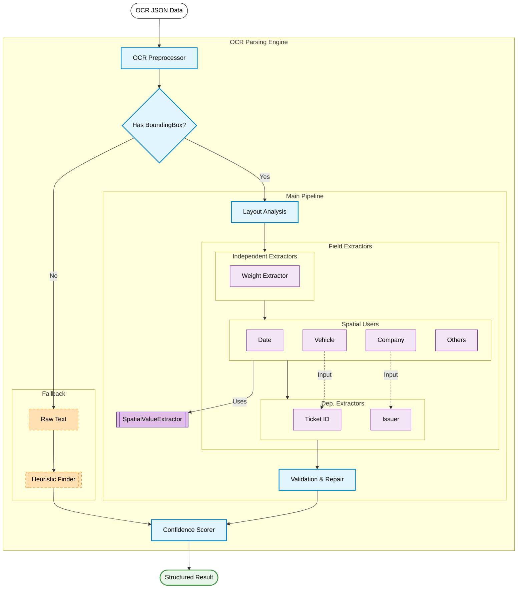

# 📄 Hybrid OCR Parsing Engine

본 프로젝트는 계근지/영수증 OCR 데이터를 분석하여 정형화된 데이터로 추출하는 **하이브리드 파싱 엔진**입니다. 단순 텍스트 매칭을 넘어 공간 분석, 산술 검증, 그리고 자연어 처리를 결합하여 높은 정확도를 제공합니다.

---

## 🚀 실행 방법 (Local Reproduction)

### 1. 환경 구축
Python 3.12의 환경에서 다음 명령어를 실행하여 필수 라이브러리를 설치합니다.

```bash
# 의존성 패키지 설치
pip install -r requirements.txt

# spaCy 한국어 모델 설치 (필수)
python -m spacy download ko_core_news_sm
```

### 2. 대시보드 실행
Streamlit 기반의 시각화 도구를 통해 OCR JSON 파일을 업로드하고 파싱 결과를 실시간으로 확인할 수 있습니다.

```bash
streamlit run app.py
```

### 3. 테스트 및 성능 검증
전체 샘플 데이터(`sample_data_ocr/`)에 대한 추출 정확도를 테스트하고 리포트를 생성합니다.

```bash
# 전체 파싱 테스트 실행
python test/test_hybrid.py

# 정답지(answer.md)와 비교 및 정확도 리포트 생성
python test/compare_answer.py
```
*테스트 결과는 `comparison_report.txt`에 저장됩니다.

---

## 🛠️ 의존성 및 환경

- **Core**: Python 3.12.5
- **UI & Visualization**: `streamlit` (대시보드 운영)
- **Data Processing**: `pandas` (결합 및 통계)
- **NLP & Fuzzy Matching**: 
    - `spacy` (개체명 인식을 통한 발행처/회사명 추출)
    - `rapidfuzz` (OCR 오타 보정 및 라벨 매칭)
- **Custom Engines**:
    - `AdvancedNoiseNormalizer`: OCR 특화 오인식 교정 엔진 (O->0, B->8 등 및 문맥 보정)
    - `UnifiedWeightEngine`: 산술 검증 기반 중량 추출 엔진

---

## 📥 입력 데이터 포맷 (Input Data Format)

본 엔진은 일반적인 OCR 서비스와 호환되는 **표준 JSON 구조**를 입력으로 가정합니다.

### 필수 항목 (Required Fields)
- **`pages`**: 페이지 단위의 배열 (List)
- **`words`**: 각 페이지 내의 단어 단위 객체
- **`text`**: 인식된 텍스트 문자열
- **`boundingBox`**: 4개의 꼭지점 좌표 (`vertices`: x, y)
- **`confidence`**: (선택) OCR 엔진의 신뢰도 점수

### JSON 예시 (Sample JSON Structure)
```json
{
  "pages": [
    {
      "words": [
        {
          "boundingBox": {
            "vertices": [
              {"x": 105, "y": 288},
              {"x": 156, "y": 286},
              {"x": 156, "y": 308},
              {"x": 105, "y": 310}
            ]
          },
          "text": "계량",
          "confidence": 0.98
        }
      ]
    }
  ]
}
```

---

## 🏗️ 설계 및 주요 가정

### 1. 하이브리드 추출 전략 (3-Layer)
- **Layer 1: Spatial Analysis**: 라벨과 숫자 간의 기하학적 거리와 정렬 상태를 분석합니다.
- **Layer 2: Heuristic Regex**: 전표번호, GPS 좌표, 날짜 등 정형화된 패턴을 정규식으로 정밀 타격합니다.
- **Layer 3: NLP NER**: 라벨이 없거나 모호한 발행처/업체명은 spaCy의 개체명 인식(NER)을 사용하여 문맥을 파악합니다.

### 2. 중량 추출의 앙상블 시스템
중량 데이터는 `총중량 = 공차중량 + 실중량`이라는 도메인 지식을 바탕으로 3가지 전략(방정식 기반, Y축 순서 기반, 키워드 근접성)을 투표(Ensemble Voting)시켜 최종 값을 결정합니다.

### 3. 주요 가정
- 모든 계량표에는 최소한 하나 이상의 일관된 중량 흐름이 존재한다고 가정합니다.
- OCR 데이터는 `WordBox` 단위의 좌표 정보(boundingBox)를 포함하고 있다고 가정하며, 없을 경우 텍스트 기반 휴리스틱 엔진으로 자동 전환됩니다.

### 4. 고급 필드 추출 전략
- **Product Extraction**:
    - **Context-Aware Splitting**: "국판구분출"과 같이 제품명과 다음 필드 라벨이 붙어있는 경우, 문맥(Next Label)을 파악하여 자동으로 분리합니다.
    - **Whitespace Normalization**: "혼 합 폐 기 물"과 같이 과도한 공백이 포함된 한글 텍스트를 정규화합니다.
- **Company Extraction**:
    - **Label Noise Filtering**: "품명", "제품" 등의 라벨이 회사명으로 오인식되는 것을 방지하기 위한 강력한 필터링 로직이 적용되었습니다.


---

## 🧩 시스템 구조 (System Architecture)

**OCR 파싱 엔진(OCR Parsing Engine)** 내부의 추출기(Extractor) 상호 의존성 및 데이터 흐름도입니다.



### 구조 설명
- **Main Pipeline**: 좌표 정보(Bounding Box)를 활용하여 정밀하게 데이터를 추출합니다.
  - **Independent**: 좌표 없이도 동작 가능한 중량 추출기
  - **Spatial Users**: 좌표 분석이 필수적인 일반 필드 (날짜, 차량, 상호 등)
  - **Dependent**: 다른 필드의 값에 의존하여 검증이 필요한 필드 (전표번호, 발행처)
- **Fallback Pipeline**: 좌표가 없을 때 텍스트 패턴(Regex)만으로 데이터를 추출하는 비상 로직입니다.

---

## 📂 프로젝트 구조 (Directory Structure)

```text
ocr_parsing
├─ docs/                  # 프로젝트 문서
│
├─ extractors/            # 추출기 핵심 모듈
│  ├─ base.py             # 기본 추출기
│  ├─ common.py           # 공통 데이터 구조
│  ├─ config.py           # 파싱 상수/설정
│  ├─ core.py             # 메인 추출 제어
│  ├─ domain.py           # 도메인 검증 로직
│  ├─ field_extractors.py # 필드별 추출기
│  ├─ heuristic_finder.py # 정규식 기반 탐색
│  ├─ label_detector.py   # 라벨(Key) 탐지
│  ├─ normalizer.py       # 오타/노이즈 보정
│  ├─ spatial_extractor.py# 공간(좌표) 분석
│  └─ weight_engine.py    # 중량 추출/검증
│
├─ sample_data_ocr/       # 테스트용 샘플 JSON
├─ test/                  # 정확도 테스트 스크립트
│
├─ app.py                 # 웹 대시보드 (Streamlit)
├─ parser.py              # OCR 파싱 엔진의 엔트리포인트 (Main Parser Class)
├─ confidence_scorer.py   # 신뢰도 점수 계산
├─ requirements.txt       # 의존성 패키지
└─ comparison_report.txt  # 테스트 결과 리포트
```

> **상세 문서**: [📂 상세 분석 보고서 (Detailed Documentation)](docs/detailed_documentation.md)  
> `extractors/` 모듈, `confidence_score`, `boundingBox` 등 핵심 로직에 대한 상세 설명이 포함되어 있습니다.

---

## ⚠️ 한계 및 개선 아이디어

### 현재 한계
- **극심한 기울기(Tilt)**: OCR 엔진 자체가 기울어진 텍스트를 제대로 읽지 못했을 경우, 공간 분석 엔진의 성능이 저하될 수 있습니다.
- **다양한 규격**: 표준화되지 않은 매우 특이한 양식의 영수증에서는 정규식 패턴이 어긋날 가능성이 있습니다.

### 개선 아이디어
- **유연한 JSON 방식 지원**: 다양한 OCR 엔진(Google Vision, Azure, Clova 등)의 상이한 JSON 출력 포맷을 하나의 표준 구조(WordBox)로 변환하여 처리.
    - **기간**: 약 1주 소요 예상
    - **방법**: 입력 단계에 `Adapter Pattern`을 도입하여 전처리(Preprocessing) 레이어를 추상화 및 분리.
- **LLM 하이브리드**: 규칙 기반 엔진이 "낮은 신뢰도"를 기록했을 때만 선택적으로 대형 언어 모델(Gemini, GPT 등)을 호출하여 고정밀 파싱 구현.
    - **기간**: 약 2주 소요 예상 (프롬프트 엔지니어링 및 테스트 포함)
    - **방법**: `Parser` 클래스 내에 `FallbackLLMEngine`을 추가하고, 신뢰도 임계값(Threshold < 50) 미달 시 API 호출 로직 분기.
- **Multi-page 지원**: 여러 장의 영수증 사진이 하나의 PDF나 JSON으로 들어오는 경우를 위한 페이지 분할 및 통합 로직.
    - **기간**: 약 3일 소요 예상
    - **방법**: `pages` 배열을 순회하며 각 페이지를 독립된 `Document` 객체로 처리한 후, 최종 결과 리스트(List)로 반환하도록 파이프라인 확장.
