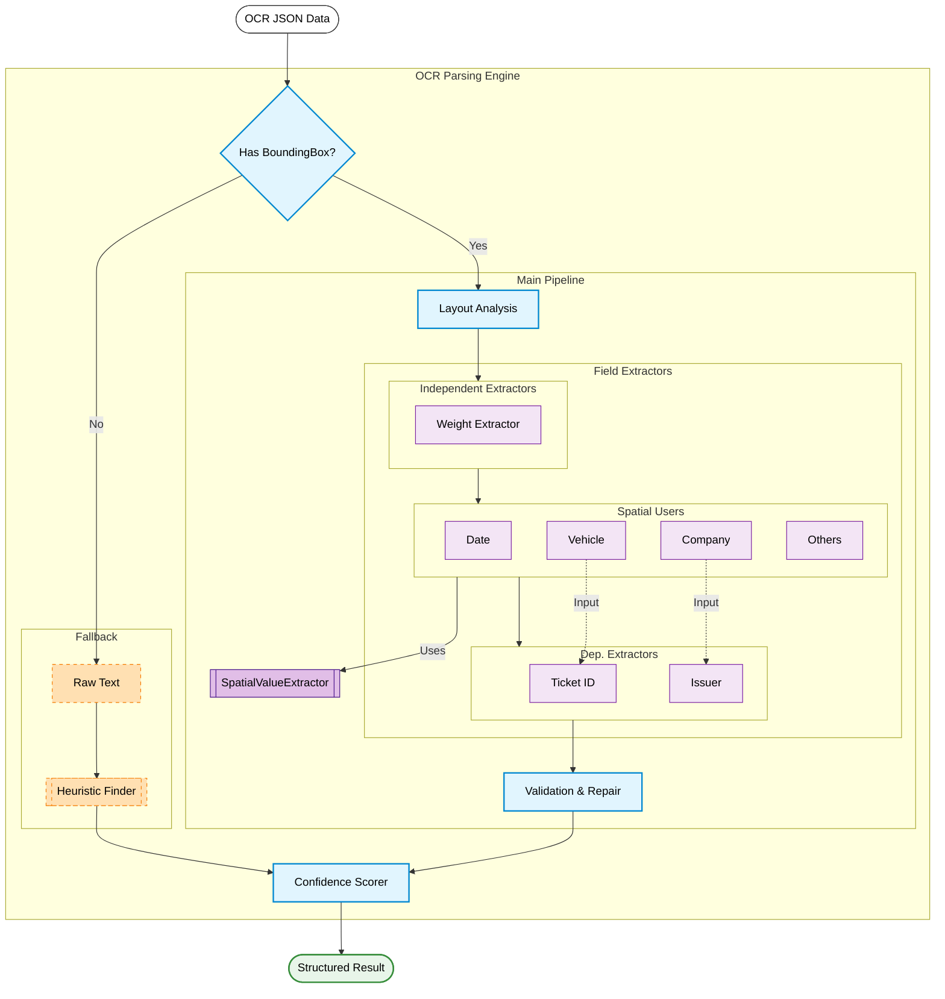

# OCR Parsing System Structure

현재 프로젝트의 **OCR 파싱 엔진(OCR Parsing Engine)** 내부 동작 흐름과 각 추출기(Extractor) 간의 의존성 구조도입니다.

## 주요 구성 요소 설명

### 1. Main Pipeline (Smart Extraction)
좌표 정보(Bounding Box)가 있는 경우 실행되는 주 파이프라인입니다.

- **Weight Extractor**: `UnifiedWeightEngine`을 사용하여 중량(총중량, 공차중량, 실중량)을 추출합니다. 공간 분석 모듈(`SpatialValueExtractor`)을 사용하지 않고 자체적인 로직(방정식 검증, Y축 정렬 등)을 가집니다.
- **Spatial Users**: `Date`, `Vehicle`, `Company` 등 일반 필드들은 `SpatialValueExtractor`를 사용하여 라벨(Label) 주변의 값을 공간적으로 탐색합니다.
- **Dependent Extractors**:
  - `Ticket ID`: 차량번호(`Vehicle Number`)와 혼동되지 않도록 차량번호 추출 결과를 입력받아 제외 로직을 수행합니다.
  - `Issuer`: 상호(`Company`)와 발행처(`Issuer`)가 동일하게 추출되는 것을 방지하기 위해 상호 추출 결과를 참조하여 검증합니다.

### 2. Fallback Pipeline (Text Only)
좌표 정보가 손실되었거나 텍스트만 존재하는 경우 실행되는 예비 파이프라인입니다.

- **HeuristicValueFinder**: 정규식(Regex) 패턴 매칭을 통해 텍스트 내에서 값을 찾아냅니다. 정확도는 떨어지지만 좌표 없이도 동작합니다.

### 3. Validation & Scoring
- **Cross-Validation**: 중량 간의 관계(`총중량 = 공차 + 실중량`) 검증 및 상호/발행처 중복 검증을 수행합니다.
- **Confidence Scorer**: 필수 필드 누락 여부, 중량 오차 등을 종합하여 최종 결과의 신뢰도 점수(0~100)를 산출합니다.